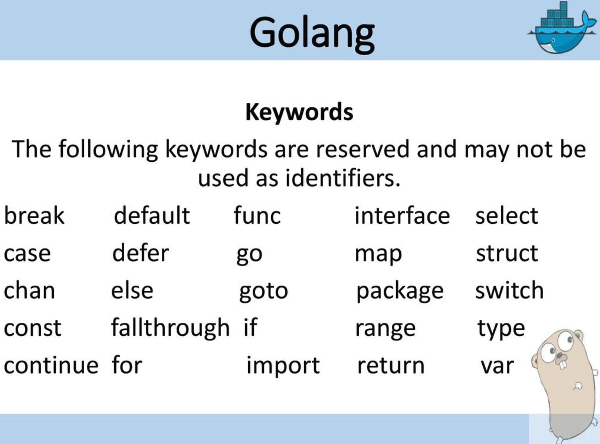
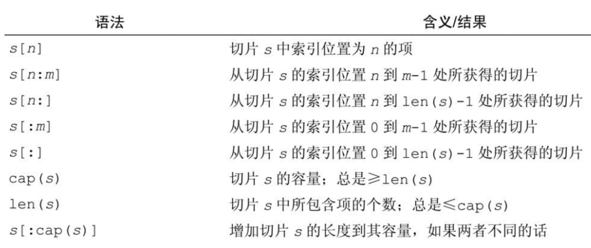

# Go 语言基础

## 基本概念

### 25 个关键词



### 包

一个`.go`源文件是从**包**开始的，通过`package`声明一个包。需要注意的是，对于`main`包，一个程序有且仅有一个

在 Go 语言中，`main`包是一个特殊的概念，它包含程序的入口点。当你运行一个 Go 程序时，实际上是在运行`main`包里的`main`函数。这是 Go 语言规定的一种结构，其原因有以下几点：

1. **单一入口点**：每个可执行的 Go 程序必须有一个且仅有一个`main`包，其中包含`main`函数。这提供了一个明确的起点，Go 运行时知道从哪里开始执行程序。
2. **避免混淆**：如果允许任何包都可以作为程序的入口，那么在构建复杂的项目时可能会引起混淆，因为编译器将不知道哪个函数是真正的入口点。通过限制入口点到`main`包，这种不确定性被消除了。
3. **标准库兼容性**：Go 的标准库和其他包都假设`main`函数是程序的起点。如果改变这一点，可能会影响到标准库的某些行为，比如初始化过程，导致不可预测的结果。
4. **构建和运行逻辑**：当你使用`go run`或`go build`命令时，这些工具会寻找`main`包。如果没有找到`main`包，`go run`将无法运行程序，`go build`将无法生成可执行文件，因为它们不知道如何构建一个可独立运行的二进制文件。
5. **清晰的架构**：`main`包的存在有助于组织代码。它将程序的启动逻辑与其他功能代码分离，使得代码结构更加清晰，也更容易理解程序的执行流程。

因此，如果你想创建一个可独立运行的程序，你必须在你的项目中定义一个`main`包，且该包中必须包含一个`main`函数。这个函数的签名是固定的：

```go
func main() {
    // 程序的主逻辑
}
```

`main`函数是程序的入口点，没有返回值，也没有参数。当你的程序启动时，Go 运行时会直接调用这个函数。

### 入口

每个 go 程序都以 `main` 函数作为入口。定义函数使用 `func` 开头

### 权限修饰符

> 包里**只有大写开头的函数才能被其他包导入使用**

Go 语言并没有像 C++、Java 或其他一些语言中那样提供`private`和`public`这样的显式访问控制修饰符。相反，Go 语言使用了一种基于标识符（如变量、函数、类型等）首字母大小写的约定来控制可见性：

- **大写字母开头的标识符**：这些标识符是“公开的”（public），意味着它们可以从定义它们的包外部访问。这类似于其他语言中的`public`。
- **小写字母开头的标识符**：这些标识符是“私有的”（private），只能在定义它们的包内部访问。这类似于其他语言中的`private`。

例如，考虑下面的 Go 代码片段：

```go
package mypackage

// 公开的函数
func PublicFunction() {
    // ...
}

// 私有的变量
var privateVariable int
```

在这个例子中，`PublicFunction`因为首字母是大写，所以可以从其他包中访问。而`privateVariable`因为首字母是小写，只能在`mypackage`包内部访问。

此外，对于结构体内的字段和方法，同样的规则适用。如果字段或方法名以大写字母开头，则它们对外部是可见的；如果以小写字母开头，则只在定义的包内可见。

这种基于大小写的访问控制机制简化了 Go 语言的语法，并且使代码更易于阅读和理解，因为它不需要额外的修饰符来表达成员的可见性。同时，这也鼓励了模块化设计，因为包的作者可以轻松地控制哪些部分应该对用户开放，哪些部分应该保持内部使用。

## 数据结构（只看特有）

### bool

一些编程语言使用 0 和非 0 表示。但是 go 里比如 if 语句后边只能是 bool 值或者返回 bool 值的表达式，而不像 c 一样可以使用 int 值

### slice

切片比数组更加灵活，长度是可以变化的。



```go
func testSlice() {
    // 创建并且初始化一个 slice
    names := []string{"zhang", "wang", "li", "zhao"}
    // 打印 names, 长度和容量
    fmt.Println(names, len(names), cap(names))
    names2 := names[0:3] // 获取子切片 0,1,2 三个元素，注意左闭右开区间
    fmt.Println(names2)
    // 尝试修改一下 names2 ，注意 names 也会跟着改变么？
    names[0] = "lao zhang"
    fmt.Println(names, names2) // 你会发现names也变了，这里起始它们共用了底层结构，注意这个问题

    // 遍历一个 slice 我们使用 for/range 语法
    for idx, name := range names { // 如果没有用到下标 idx，可以写成下划线 _ 作为占位符，但是不能省略
        fmt.Println(idx, name)
    }

    // 修改切片主要通过赋值和 append 操作。使用 append 修改切片
    vals := make([]int, 0)
    for i := 0; i < 3; i++ {
        vals = append(vals, i)
    }
    fmt.Println(vals)
    vals2 := []int{3, 4, 5}
    newVals := append(vals, vals2...) // 可以使用省略号的方式『解包』一个 slice 来连接两个 slice
    fmt.Println(newVals)
}
```

### map

内置 `map` 数据结构，**作为 map 的 key，必须要是支持 == 和 != 操作符的类型**，常用的基础类型 `int`, `float64`, `string` 等都是可以作为 map 的键的，**但是像切片或者不能比较的结构体无法作为键**。而映射的值没有要求，任何内置或者自定义的类型都可以作为值

```go
// 创建一个空的map
m := make(map[string]int)
m["hello"] = 1
m["world"] = 2
m["zhang"] = 3
fmt.Println(m)

// 从map中获取key为hello的value，如果取到了赋值给v，并把ok设为true(表示获取到值)
if v, ok := m["hello"]; ok {
	fmt.Printf("m[%s] is %d \n", "hello", v)
}

// 如果只需要 k 或者 v 你可以使用 下划线作为占位符忽略值
for k, _ := range m {
	fmt.Printf("k is %s\n", k)
}
```

<u>注意：golang 中没有`Set`</u>

### struct

结构体是一种用户自定义的复合类型，可以包含多个不同类型的字段。结构体可以用来表示复杂的数据结构，如数据库记录、配置选项等。

```go
type Person struct {
    Name string
    Age  int
}
```

### interface

接口定义了一组方法的集合，任何实现了这些方法的类型都可以满足该接口。接口在 Go 语言中用于实现多态性和抽象。

```go
type Shape interface {
    Area() float64
}
```

### channel

通道用于在 goroutines 之间安全地通信和同步。通道可以发送和接收数据，是 Go 语言并发模型的关键部分。

```go
ch := make(chan int) // 创建一个整数通道
```

### pointer

虽然指针不是严格意义上的复合类型，但它可以指向其他类型的变量，并间接地访问和修改它们的值。在 Go 中，指针经常用于高效地操作数据，特别是大型结构体或数组。

```go
var p *int // 定义一个指向整数的指针
```

### 空值

在 Go 语言中，每个类型都有一个默认的零值（zero value），也被称为“空值”。这个值在变量被声明但没有显式初始化时自动赋予变量。零值取决于数据类型：

- 对于数值类型，零值通常是 0。
- 对于布尔类型，零值是 false。
- 对于字符串类型，零值是空字符串""。
- 对于引用类型（如指针、切片、映射、通道、函数和接口），零值是 nil。

nil 是一个预定义的标识符，表示一个没有绑定到任何对象的指针或引用。例如：

```go
var ptr *int // ptr 的值是 nil
var slice []int // slice 的值是 nil
var mapVar map[string]int // mapVar 的值是 nil
```

在 Go 语言中，nil 可以用来表示“空”或“无效”的引用，这与许多其他语言中的 null 关键字的作用相似。然而，Go 的 nil 与 null 有所不同，因为 Go 的类型系统更严格，nil 只能用于引用类型，而不能用于基本类型。

### 其他情况

**在 Go 语言中，并没有像 TypeScript 那样的 any 类型，这是因为 Go 是一种静态类型语言，要求在编译时确定所有变量的类型。**

然而，Go 语言中存在一种类似的机制，那就是使用 interface{}类型。interface{}是一个空接口，可以持有任何类型的值。这使得你可以在不知道确切类型的情况下处理变量，类似于 any 在 TypeScript 中的作用。例如：

```go
var data interface{} = "Hello, World!"
fmt.Println(data) // 输出: Hello, World!
```

在上面的代码中，data 变量可以接受任何类型的值，这与 TypeScript 中的 any 类型相似。但是，与 any 不同的是，当你使用 interface{}时，你通常需要显式地进行类型断言或检查，以便在运行时获取变量的实际类型并使用它：

```go
if str, ok := data.(string); ok {
    fmt.Println("It's a string:", str)
} else {
    fmt.Println("It's not a string")
}
```

## 流程控制

**go 语言提供了三种分之方式，if/switch/select**

### if 语句

- if 条件只能是一个 bool 值或者返回 bool 值得表达式，而不能是 int
- if 后边是可以先跟一个表达式，比如：获取 map 值的 `if v,ok := m[key]; ok {}`

### switch/case

go 里改善了 c 语言的 switch，比如我们**不用每一个 case 都要加上 break**

### for 循环

**go 只提供了一个关键词 for 来实现循环**（没有 `while` 和 `do while`）

```go
// 常规用法，和其他语言类似
for optionalPreStatement; booleanExpress; optionalPostStatement {
  block
}

// 无限循环，block 会被一直重复执行
for {
  block
}

// 实现while循环，block 一直执行直到 表达式为false
for booleanExpression {
  block
}
```

此外 for/range 语法还支持让我去迭代字符串，数组，切片，map 或者通道(channel)

```go
func testFor() {
    intSlice := []int{3, 2, 1}
    for index, item := range intSlice {
        fmt.Println(index, item)
    }
    for index := range intSlice { // 省略 item 之后遍历的是 key，注意不像python 直接遍历值
        fmt.Println(index)
    }

    m := map[string]string{"k1": "v1", "k2": "v2"}
    for k, v := range m {
        fmt.Println(k, v)
    }
    for k := range m {
        fmt.Println(k)
    }
}
```

**go 使用 break 和 continue 分别跳出或者进入下一个循环**

### 其他流程控制

- goto：go 和 c 一样支持 goto 语句，用法也和其一致
- label：当深层嵌套的 for 循环想要直接快速退出所有循环体的时候，我们可以使用 break 标签语法来实现

```go
package main

import "fmt"

func main() {
    var i, j int

// loop 标签。注意 break和continue 的标签需要在代码块前边，goto 没有这个限制
loop:
    for i = 0; i < 10; i++ {
        for j = 0; j < 3; j++ {
            if i+j > 3 { // 如果 i + j > 3 ，跳出所有循环
                break loop
            }
            fmt.Printf("i[%d] j[%d] i+j[%d]\n", i, j, i+j)
        }
    }
    fmt.Println(i + j)
}
```

## 周边工具

- goimports：自动 import
  - 说明： https://blog.boot.dev/golang/format-on-save-vs-code-golang/
  - 安装：`go install golang.org/x/tools/cmd/goimports@latest`
- golint：
  - 说明：https://golangci-lint.run/
  - 安装：`brew install golangci-lint`

### 常用命令

1. go `run xx.go`：运行源码，go 允许在未编译的情况下，运行源码
2. go `build xx.go`：编译源码，把源文件编译成系统级二进制文件，可直接执行：`./xx`

## 资料

- 快捷版入门：https://pegasuswang.github.io/LetsGo
- 入门到进阶：https://github.com/jincheng9/go-tutorial
- 完整视频教程：https://www.bilibili.com/video/BV1334y1U7cH/?spm_id_from=333.999.section.playall&vd_source=5aca4d2c1274f0ad427819c072c418c7
- 系统化书籍：https://github.com/unknwon/the-way-to-go_ZH_CN
