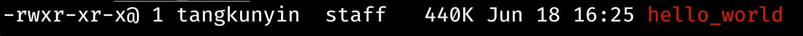

# Hello-World

## Coding first

1. Use an editor that you like. Here I use `Cursor` with [rust-analyzer](https://github.com/rust-lang/rust-analyzer)
2. Create a file named `hello_world.rs`, then under the terminal, run `rustc hello_world.rs`

```rust
fn main() {
    println("Hello, world!");
}
```

After the compilation, you will see a binary file `hello_world`, which is Rust's build file. Just run the file like this `./hello_world`



## Things to Keep in Mind
